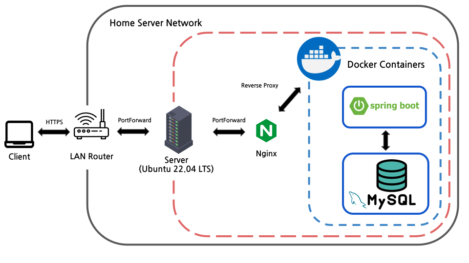
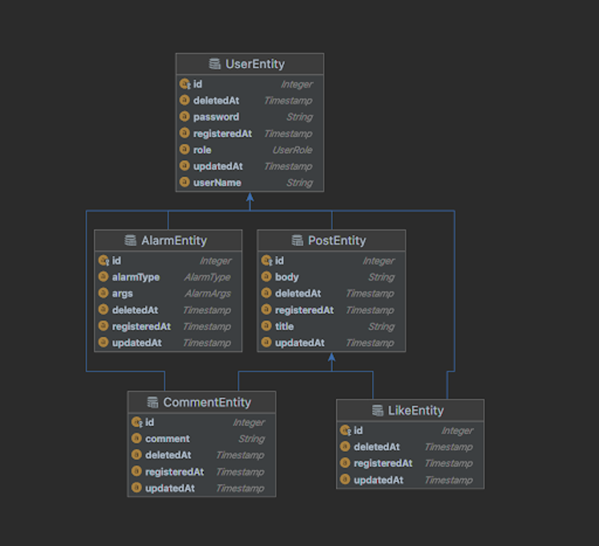

- - -
# 💬 프로젝트 설명
- - -
## 🔨 TECH STACK


- - -
## ▶ 개발환경
> - 에디터 : Intellij Ultimate
> - 개발 툴 : SpringBoot 2.7.5
> - 자바 : JAVA 11
> - 빌드 : Gradle 6.8
> - 서버 : AWS EC2
> - 배포 : Docker
> - 데이터베이스 : MySql 8.0
> - 필수 라이브러리 : SpringBoot Web, MySQL, Spring Data JPA, Lombok, Spring Security
- - -
## ▶ Architectures
> 
- - -
## ▶ ERD
> 
- - -
　
## ▶ Deployment
```shell
sudo sh deploy.sh {db.url} {db.username} {db.password} {jwt.secret} {port} {gitlab.username} {project.name}
```
　
- - -
　
## ▶ Access address
```shell
{address}:{port}
```
　
- - -

## ▶ 📃 Swagger-ui address
```
http://ec2-43-200-177-246.ap-northeast-2.compute.amazonaws.com:8080/swagger-ui/
```
　
- - -
　
## ▶ 📔Endpoint

|  구분  |  HTTP  |              URI              |          설명           |
|:----:|:------:|:-----------------------------:|:------------------------:|
| USER |  POST  |       api/v1/users/join       |         회원가입          |
| USER |  POST  |      api/v1/users/login       |      로그인 및 토큰 발급      |
| USER |  POST  | api/v1/users/{id}/role/change | 유저 권한 변경 (ONLY ADMIN) |
| POST |  GET   |         api/v1/posts          |      게시글 리스트 조회       |
| POST |  GET   |       api/v1/posts/{id}       |       게시글 상세 조회       |
| POST |  POST  |         api/v1/posts          |        게시글 등록         |
| POST |  PUT   |       api/v1/posts/{id}       |        게시글 수정         |
| POST | DELETE |       api/v1/posts/{id}       |        게시글 삭제         |

　
### ◆ 기본 URL 
```
/api/v1/
```
　
### ◆ 회원 인증·인가 URL
```
/users
```

#### ◇ 회원가입 기능
- **POST** `/api/v1/users/join`   
- **API**
```json
{
  "userName": "String",
  "password": "String"
}
```
- **Return Body(JSON)**
```json
{
  "resultCode": "SUCCESS",
  "result": {
    "userId": 5,
    "userName": "test1"
  }
}
```
#### ◇ 로그인 기능
- **POST** `/api/v1/users/login`   
- **API**
```json
{
  "userName": "String",
  "password": "String" 
}
```
- **Return Body(JSON)**
```json
{
  "jwt": "eyJhbGciOiJIU"
}
```
　
　
### ◆ 포스트 URL
```
/posts
```
#### ◇ 리스트 기능
- **GET** `/api/v1/posts`
- **Return Body(JSON)**
```json
{"content":
[
  {"id":4,"title":"test","body":"body","userName":"test","createdAt":"2022-12-16T16:50:37.515952"},
  {"id":3,"title":"string","body":"string","userName":"kyeongrok","createdAt":"2022-12-16T15:13:19.663287"},
  {"id":1,"title":"title1","body":"body1","userName":"yeram_test1","createdAt":null},
  {"id":2,"title":"title1","body":"body1","userName":"yeram_test1","createdAt":null}],
  "pageable":
  {"sort":{"empty":false,"unsorted":false,"sorted":true},
    "offset":0,"pageNumber":0,"pageSize":20,"paged":true,"unpaged":false},
  "last":true,"totalElements":4,"totalPages":1,"size":20,"number":0,
  "sort":{"empty":false,"unsorted":false,"sorted":true},
  "numberOfElements":4,"first":true,"empty":false}
```
#### ◇ 상세 기능
- **GET** `/api/v1/posts/{postsId}`
- **Return Body(JSON)**
```json
{
  "id" : 1,
  "title" : "title1",
  "body" : "body",
  "userName" : "user1",
  "createdAt" : yyyy/MM/dd HH:mm:ss,
  "lastModifiedAt" : yyyy/MM/dd HH:mm:ss
}
```
#### ◇ 등록 기능
- **POST** `/api/v1/posts`
- **API**
```json
{
  "title": "String",
  "body": "String"
}
```
- **Return Body(JSON)**
```json
{
  "resultCode":"SUCCESS",
  "result":{
    "message":"포스트 등록 완료",
    "postId":0
  }
}
```
#### ◇ 수정 기능
- **PUT** `/api/v1/posts/{id}`
- **API**
```json
{
  "title": "String",
  "body": "String"
}
```
- **Return Body(JSON)**
```json
{
  "resultCode":"SUCCESS",
  "result":{
    "message":"포스트 수정 완료",
    "postId":0
  }
}
```
#### ◇ 삭제 기능
- **DELETE** `/api/v1/posts/{id}`
- **API**
```json
{
  "id": "Integer"
}
```
- **Return Body(JSON)**
```json
{
  "resultCode":"SUCCESS",
  "result":{
    "message":"포스트 삭제 완료",
    "postId":0
  }
}
```
　
- - -